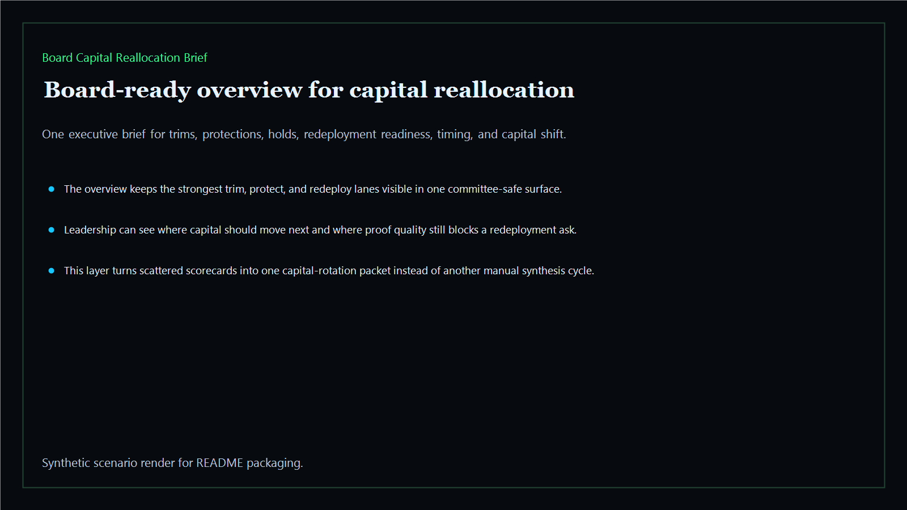
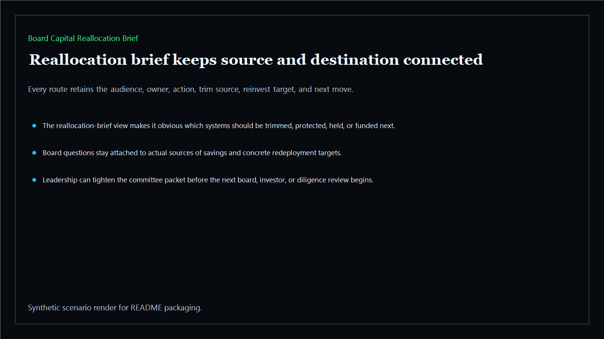
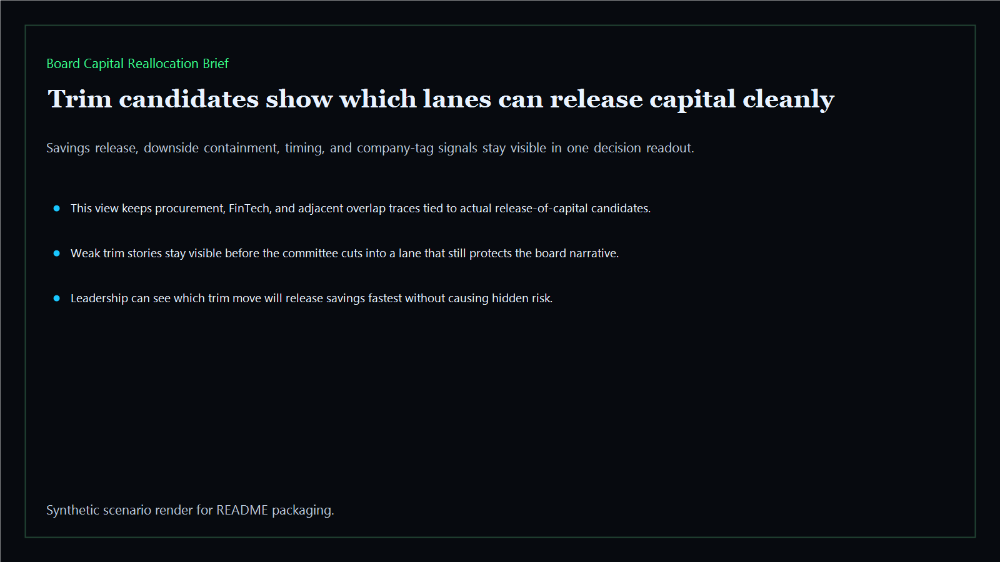
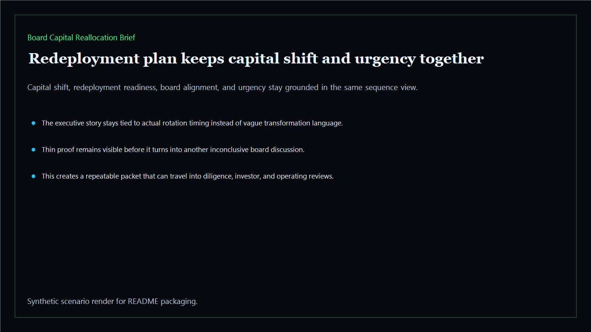

# Board Capital Reallocation Brief

Board-ready capital-reallocation brief for sequencing trims, protections, holds, and reinvestment moves across the executive estate.

- Live: `https://reallocate.kineticgain.com/`
- Repo: `mizcausevic-dev/board-capital-reallocation-brief`

## Why this matters

Leaders need more than ranked asks. They need one brief that shows what should be trimmed, what should be protected, where savings should be redirected, and which redeployment story survives a board or diligence room.

## Product depth

- TypeScript executive-intelligence surface with savings release, redeployment readiness, downside containment, timing, board-alignment, urgency, and capital-shift scoring
- synthetic executive lanes across AI, identity, revenue, FinTech, biotech, procurement, and public-sector readiness
- reusable outputs for trim, protect, hold, and redeploy decisions, capital-rotation rollups, and board-ready risk maps
- prerendered static site, JSON payloads, screenshots, and docs
- buyer-readable capital rotation story for leaders who need to explain where money should move, where it should not move yet, and what evidence supports the decision
- technical proof that the same TypeScript model powers the CLI, JSON packet, static routes, screenshots, and verification notes

## What these repos have in common

Kinetic Gain proof surfaces turn fragmented operator data into a repeatable decision layer: a clear risk signal, accountable owner context, evidence packet, and next action. This repo applies that pattern to capital allocation so a board, investor, or executive committee can see where to trim, protect, hold, or redeploy without relying on disconnected status slides.

## Operating workflow

1. Load the synthetic executive estate and score every reallocation lane.
2. Generate the reallocation brief, trim candidate view, redeployment plan, risk map, and verification packet.
3. Publish the same evidence as API payloads, static pages, screenshots, and README documentation.
4. Use the brief to align the leadership story: where exposed capital sits, where savings are credible, and which investment lanes deserve the next dollar.

## Routes

- `/`
- `/reallocation-brief`
- `/trim-candidates`
- `/redeployment-plan`
- `/verification`
- `/docs`

## Local run

```bash
cd board-capital-reallocation-brief
npm install
npm run verify
npm run prerender
npm run render:assets
```

## CLI

```bash
npx board-capital-reallocation-brief fixtures/board-capital-reallocation-brief.json --format summary
npx board-capital-reallocation-brief fixtures/board-capital-reallocation-brief-clean.json --format json
```

## Docs

- [Architecture](docs/architecture.md)
- [Origin](docs/ORIGIN.md)
- [Kinetic Gain Embedded](docs/KINETIC_GAIN_EMBEDDED.md)

## Screenshots





